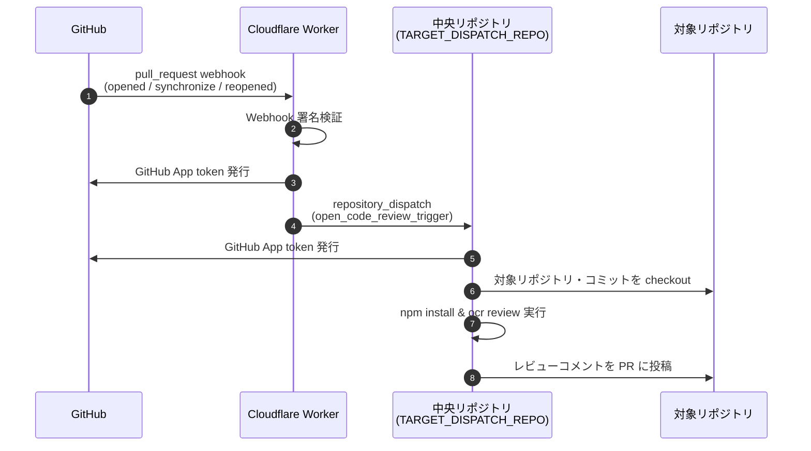
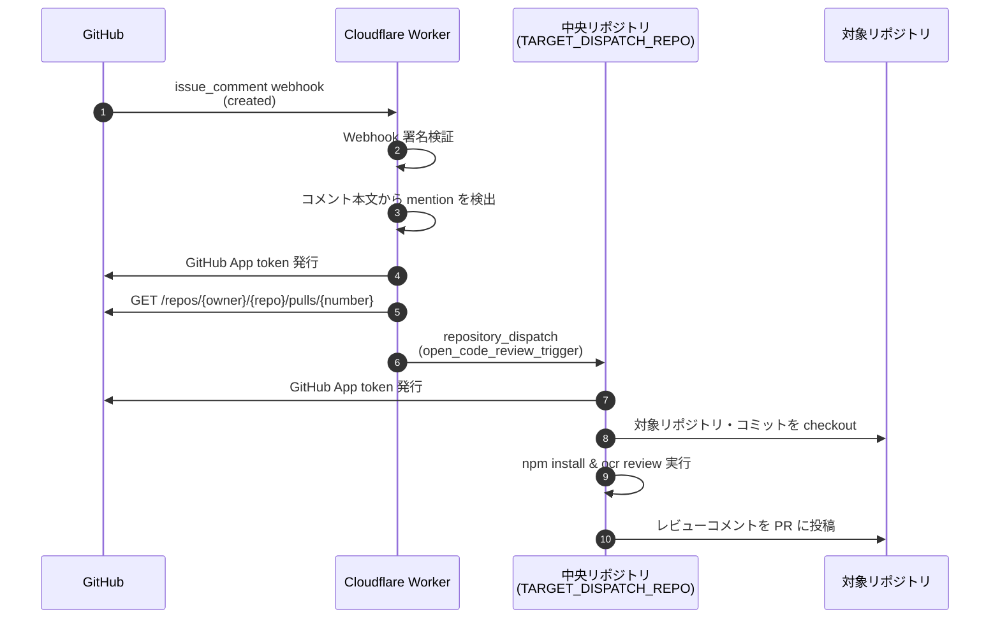

# OpenCodeReview GitHub App Backend (ocr-app)

このリポジトリは、Alibaba 製 AI コードレビューツール **OpenCodeReview (OCR)** を
GitHub App (Zero-YAML 構成) として提供するための専用バックエンドリポジトリです。

## コンポーネント構造
- **`cloudflare-worker/`**: GitHub App からの Webhook を受信し、
  `repository_dispatch` を送る Cloudflare Worker (無料枠)
  - `pull_request` イベント（自動レビュー）と `issue_comment` イベント（mention トリガー）に対応

## Cloudflare Worker 設定契約

### 環境変数

| 環境変数 | 必須 | 説明 |
| --- | --- | --- |
| `GITHUB_APP_ID` | はい | GitHub App の ID |
| `GITHUB_APP_PRIVATE_KEY` | はい | GitHub App の秘密鍵 |
| `WEBHOOK_SECRET` | はい | Webhook 署名検証用シークレット |
| `TARGET_DISPATCH_REPO` | いいえ | dispatch 先リポジトリ。未設定時は `yohi/ocr-app` |
| `GITHUB_APP_SLUG` | はい | GitHub App の slug。mention 検出に使用。例: `opencodereview-app` |

### Webhook と GitHub App

| 項目 | 値・要件 |
| --- | --- |
| Webhook の `Content-Type` | `application/json` |
| Webhook event | `pull_request`、`issue_comment`（`ping` も受信可） |
| 署名検証 | `X-Hub-Signature-256` ヘッダー（`sha256=<64桁の16進数>`） |
| 送信イベント種別 | `open_code_review_trigger` |
| GitHub App 権限（dispatch 先） | `TARGET_DISPATCH_REPO` の `Contents: write` |
| Mention トリガー | PR コメントで `@<GITHUB_APP_SLUG> review` と入力 |

> **注意**: Webhook の Secret と Worker の環境変数 `WEBHOOK_SECRET` には必ず同じ値を設定してください。

## GitHub Apps 経由の実行フロー

GitHub App としてインストールされたリポジトリで PR が開かれると、
以下の流れで自動的にコードレビューが実行されます。



### 各ステップの詳細

1. **PR イベントの発火**
   - `pull_request` イベントのうち `opened` / `synchronize` / `reopened` のみを処理します。
2. **Cloudflare Worker での署名検証**
   - `X-Hub-Signature-256` ヘッダーを `WEBHOOK_SECRET` で検証します。
3. **GitHub App token の発行**
   - Worker が `GITHUB_APP_ID` / `GITHUB_APP_PRIVATE_KEY` を使って token を生成します。
4. **`repository_dispatch` の送信**
   - `TARGET_DISPATCH_REPO`（未設定時は `yohi/ocr-app`）に対して、
     `open_code_review_trigger` タイプの dispatch を送信します。
   - payload には `target_repo`、`pr_number`、`commit_sha`、`installation_id` が含まれます。
5. **中央リポジトリの `ocr-engine.yml` が起動**
   - GitHub App token を発行します。
   - 対象リポジトリ・コミットを checkout します。
   - `@alibaba-group/open-code-review` をインストール・設定します。
   - `ocr review` を実行します。
6. **レビュー結果の投稿**
   - `.github/workflows/scripts/post-ocr-comments.mjs` を使って、
     対象 PR にインラインでレビューコメントを投稿します。
7. **失敗時**
   - `/tmp/ocr-result.json` と `/tmp/ocr-stderr.log` を
     `ocr-debug-logs` という Artifact として保存します。
### Mention トリガーによる実行フロー

PR コメントで `@<GITHUB_APP_SLUG> review` とメンションすることで、
オンデマンドでコードレビューを実行できます。



### 各ステップの詳細（Mention トリガー）

1. **コメントの投稿**
   - PR に `@opencodereview-app review` のようなコメントが投稿されます。
2. **Cloudflare Worker での処理**
   - `issue_comment` イベントのうち `created` のみを処理します。
   - `issue.pull_request` の存在を確認し、PR コメントのみを対象とします。
   - コメント本文から `@<GITHUB_APP_SLUG>(?:\[bot\])?\s+review` のパターンを検出します。
3. **PR 詳細の取得**
   - GitHub API で `GET /repos/{owner}/{repo}/pulls/{number}` を呼び出し、
     最新の `head.sha` を取得します。
4. **`repository_dispatch` の送信**
   - 以降のフローは「GitHub Apps 経由の実行フロー」の Step 3 以降と同じです。

## GitHub App の作成と設定

GitHub App は以下の 2 つの認証に使用されます。

- **Cloudflare Worker**: `pull_request` イベントの受信と
  `repository_dispatch` 送信時の認証
- **ocr-engine.yml**: 対象リポジトリの checkout と
  レビューコメント投稿時の認証

### 1. GitHub App の作成

1. **Settings → Developer settings → GitHub Apps → New GitHub App**
   を開きます。
2. 以下の項目を入力します。

   | 項目 | 値 |
   | --- | --- |
   | GitHub App name | 任意（例: `OCR App Backend`） |
   | Homepage URL | 任意（例: 本リポジトリの URL） |
   | Webhook URL | 後述の Worker の URL（作成後も変更可） |
   | Webhook secret | ランダムな文字列（Worker と同一値） |

3. **Permissions** を以下のように設定します。

   | Permission | Access |
   | --- | --- |
   | Contents | Read & write |
   | Pull requests | Read & write |
   | Issues | Read & write |

   **Contents: Read & write** は `repository_dispatch` の送信に、
   **Pull requests / Issues: Read & write** はレビューコメントの
   投稿に必要です。

4. **Subscribe to events** で **Pull requests** と **Issue comments** を選択します。
5. **Where can this GitHub App be installed?** は
   **Any account** を選択します。
6. **Create GitHub App** をクリックします。

### 2. Private key の生成

1. App 設定ページの **Private keys** で **Generate a private key** を
   クリックします。
2. ダウンロードされた `.pem` ファイルを安全に保管します。
   - この内容（`-----BEGIN ... PRIVATE KEY-----` で始まる文字列）が
     Actions の Secret `GH_APP_PRIVATE_KEY` として使用されます。

### 3. App のインストール

1. **Install App** をクリックし、インストール先を選択します。
2. **Only select repositories** で以下を含めます。
   - レビュー対象のリポジトリ
   - `TARGET_DISPATCH_REPO`（dispatch 先。未設定時は `yohi/ocr-app`。
     レビュー対象リポジトリと同一アカウントであること）
3. **Install** をクリックします。

Installation ID は Webhook の `installation.id` から自動取得されるため、
手動での記録は不要です。ただし、dispatch の送信にもこの Installation ID で
発行したトークンが使用されます。そのため dispatch 先は Webhook を受け取った
インストール（同一アカウント）内に存在する必要があり、別アカウントの
リポジトリへの dispatch には対応していません。

### 4. Webhook の設定

1. 後述の手順で Cloudflare Worker をデプロイします。
2. Worker の URL（`https://ocr-github-app-worker.<サブドメイン>.workers.dev/`）
   を App の **Webhook URL** に設定します。
3. App の **Webhook secret** には、作成時に自分で入力した値を設定します。
   GitHub は作成後にこの値を表示しないため、値が不明な場合は
   **General** タブの **Change secret** で再生成してください。
   設定した値がそのまま Worker の `WEBHOOK_SECRET` になります。
4. App 設定の **Advanced** タブ → **Recent Deliveries** で
   `ping` イベントの応答が 200 になることを確認します。

### 5. Secrets / Variables の登録

| 登録先 | 名前 | 説明 |
| --- | --- | --- |
| Actions (Secret) | `CLOUDFLARE_API_TOKEN` | Cloudflare デプロイ用 API トークン |
| Actions (Secret) | `GH_APP_ID` | GitHub App の ID（ocr-engine.yml 用） |
| Actions (Secret) | `GH_APP_PRIVATE_KEY` | Private key の内容 |
| Actions (Secret) | `WEBHOOK_SECRET` | Webhook 署名検証用シークレット |
| Actions (Variable) | `GH_APP_ID` | GitHub App の ID（Worker 用・Secret と同じ値） |
| Actions (Variable) | `GH_TARGET_DISPATCH_REPO` | dispatch 先（任意・未設定時は `yohi/ocr-app`） |
| Actions (Variable) | `GH_APP_SLUG` | GitHub App の slug（例: `opencodereview-app`） |
>
> **注意**: GitHub Actions の Secret 名は `GITHUB_` で始められません（GitHub が予約しているため）。
> そのため Actions 側では `GH_APP_ID` / `GH_APP_PRIVATE_KEY` という名前で登録します。

- **GitHub Actions**: 本リポジトリの
  **Settings → Secrets and variables → Actions** に登録します。
  LLM 関連の Secrets は [LLM の設定](#llm-の設定) を参照してください。
- **Cloudflare Worker**: Secrets `GITHUB_APP_PRIVATE_KEY` / `WEBHOOK_SECRET` は
  デプロイワークフローが Actions の Secrets（`GH_APP_PRIVATE_KEY` / `WEBHOOK_SECRET`）から、
  Vars `GITHUB_APP_ID` / `TARGET_DISPATCH_REPO` は Actions の
  Repository Variables（`GH_APP_ID` / `GH_TARGET_DISPATCH_REPO`）から
  自動設定するため、Worker 側の個別登録・`wrangler.toml` の編集は不要です。
  詳細は [Cloudflare Worker 設定契約](#cloudflare-worker-設定契約) を参照。

## GitHub Actions による構築

本リポジトリでは、Cloudflare Worker のデプロイと OCR レビューエンジンの実行を
GitHub Actions で自動化しています。

### 1. Cloudflare Worker のデプロイ

`.github/workflows/deploy-cloudflare-worker.yml` を使用します。

| 項目 | 内容 |
| --- | --- |
| トリガー | `workflow_dispatch`（手動実行のみ） |
| 必要な Secrets / Variables | `CLOUDFLARE_API_TOKEN` / `GH_APP_PRIVATE_KEY` / `WEBHOOK_SECRET`（Secret）と `GH_APP_ID` / `GH_TARGET_DISPATCH_REPO`（Variable・下記手順 2 参照） |
| 作業ディレクトリ | `cloudflare-worker` |

1. [Cloudflare API トークン](https://dash.cloudflare.com/profile/api-tokens) を作成し、
   Worker 編集に必要な権限を付与します。
2. 本リポジトリの **Settings > Secrets and variables > Actions** に登録します。
   - **Secrets** タブ: `CLOUDFLARE_API_TOKEN` / `GH_APP_PRIVATE_KEY` / `WEBHOOK_SECRET`
   - **Variables** タブ: `GH_APP_ID`（Secret と同じ値）/ `GH_TARGET_DISPATCH_REPO`（任意）
3. GitHub の Actions タブから `Deploy Cloudflare Worker (GitHub App Backend)` を選択し、
   「Run workflow」を押して手動デプロイします。
   デプロイ時に以下が自動設定されます。
   - Secrets: `GH_APP_PRIVATE_KEY` / `WEBHOOK_SECRET` → Worker の `GITHUB_APP_PRIVATE_KEY` / `WEBHOOK_SECRET`
   - Vars: `GH_APP_ID` / `GH_TARGET_DISPATCH_REPO` → Worker の `GITHUB_APP_ID` / `TARGET_DISPATCH_REPO`
   `wrangler.toml` の編集は不要です（[GitHub App の作成と設定](#github-app-の作成と設定) 参照）。

### 2. OCR レビューエンジンの実行

`.github/workflows/ocr-engine.yml` は、`repository_dispatch` イベントで起動します。
Cloudflare Worker から `open_code_review_trigger` タイプの dispatch が送信されます。

| 項目 | 内容 |
| --- | --- |
| トリガー | `repository_dispatch`（`open_code_review_trigger`） |
| 必要な Secrets | `GH_APP_ID`, `GH_APP_PRIVATE_KEY`, `OCR_LLM_URL`, `OCR_LLM_AUTH_TOKEN`, `OCR_LLM_MODEL` |
| 任意の Variables | `OCR_LLM_USE_ANTHROPIC`（未設定時は `false`） |
| 必要な Permissions | `contents: read`, `pull-requests: write`, `issues: write` |

1. [GitHub App の作成と設定](#github-app-の作成と設定) に従って
   App を作成し、ID と秘密鍵を Secrets に登録します。
2. OCR で使用する LLM の URL、認証トークン、モデル名を Secrets に登録します。
3. Anthropic API を使用する場合は Variables に `OCR_LLM_USE_ANTHROPIC=true` を設定します。
4. Worker から dispatch されると、以下の処理が実行されます。
   - GitHub App token の発行
   - 対象リポジトリ・コミットの checkout
   - `@alibaba-group/open-code-review` のインストールと設定
   - `ocr review` の実行
   - レビュー結果を PR にインライン投稿

失敗時には `/tmp/ocr-result.json` と `/tmp/ocr-stderr.log` を
`ocr-debug-logs` という Artifact として保存します。

## LLM の設定

OCR を実行する前に、使用する LLM プロバイダーの設定が必要です。

### ローカルで設定する場合

対話形式でプロバイダーとモデルを選び、接続確認まで行えます。

```bash
ocr config provider   # プロバイダー選択
ocr config model      # モデル選択
ocr llm test          # 接続確認
```

設定は `~/.opencodereview/config.json` に保存されます。

### GitHub Actions で設定する場合

`.github/workflows/ocr-engine.yml` では、以下の Secrets / Variables を使って
LLM を設定します。

| 名前 | 種別 | 説明 |
| --- | --- | --- |
| `OCR_LLM_URL` | Secret | LLM API のエンドポイント URL |
| `OCR_LLM_AUTH_TOKEN` | Secret | API キーまたは認証トークン |
| `OCR_LLM_MODEL` | Secret | 使用するモデル名 |
| `OCR_LLM_USE_ANTHROPIC` | Variable | Anthropic API 使用時は `true`、それ以外は `false` |

#### 設定例：Anthropic

| 名前 | 値の例 |
| --- | --- |
| `OCR_LLM_URL` | `https://api.anthropic.com/v1/messages` |
| `OCR_LLM_AUTH_TOKEN` | `sk-ant-...` |
| `OCR_LLM_MODEL` | `claude-opus-4-6` |
| `OCR_LLM_USE_ANTHROPIC` | `true` |

#### 設定例：OpenAI / OpenAI 互換 API

| 名前 | 値の例 |
| --- | --- |
| `OCR_LLM_URL` | `https://api.openai.com/v1/chat/completions` |
| `OCR_LLM_AUTH_TOKEN` | `sk-...` |
| `OCR_LLM_MODEL` | `gpt-4o` |
| `OCR_LLM_USE_ANTHROPIC` | `false` |

### ヒント

- Anthropic の URL は `/v1/messages`、OpenAI 互換の URL は `/v1/chat/completions` で終わる必要があります。
- `OCR_LLM_USE_ANTHROPIC` は Repository Variable なので、
  **Settings > Secrets and variables > Actions > Variables** タブで設定してください。
- Claude Code で **ローカル実行**する場合、
  `ANTHROPIC_BASE_URL` / `ANTHROPIC_AUTH_TOKEN` / `ANTHROPIC_MODEL` を
  設定していれば、OCR はそれらを自動的に利用できます。
  ただし、これらは **GitHub Actions では自動的に利用されません**。
  Actions では `OCR_LLM_URL` / `OCR_LLM_AUTH_TOKEN` / `OCR_LLM_MODEL` を Secrets として登録し、
  `ocr-engine.yml` 内で以下のように `ocr config set` へ明示的にマッピングしてください。

  ```yaml
  - name: Configure OCR
    run: |
      ocr config set llm.url "${{ secrets.OCR_LLM_URL }}"
      ocr config set llm.auth_token "${{ secrets.OCR_LLM_AUTH_TOKEN }}"
      ocr config set llm.model "${{ secrets.OCR_LLM_MODEL }}"
  ```

## セットアップ詳細

セットアップおよびドキュメント詳細は [OPEN_CODE_REVIEW_SETUP.md][setup-doc] を参照してください。

[setup-doc]:
  https://github.com/yohi/.github/blob/master/docs/OPEN_CODE_REVIEW_SETUP.md
