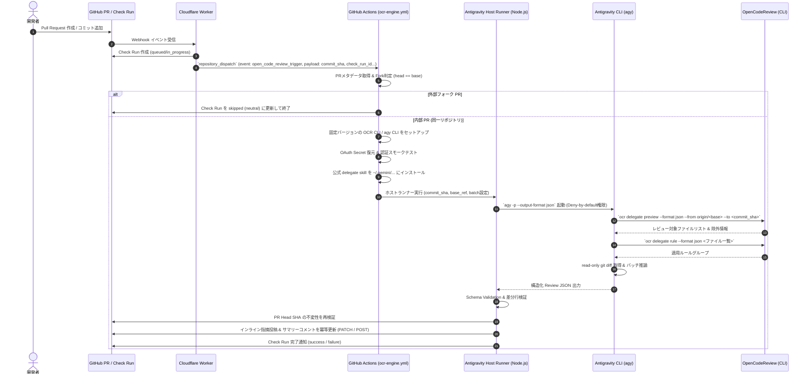

# Antigravity CLI × OpenCodeReview 統合 GitHub Actions 要件定義書

---

## 1. 概要・背景・目的

### 1.1 背景
- **AIコードレビューの需要増加**: 開発スピードの向上に伴い、PR（Pull Request）ごとの自動コードレビューが品質担保に不可欠となっている。
- **外部API課金の課題**: 外部LLM（OpenAI, Anthropic等）の従量課金APIキーを利用すると、PR数・コミット数に比例してコストが増加する。
- **Antigravity CLI のクレジット活用**: 契約済みの Antigravity アカウント / サブスクリプション枠を活用することで、追加の外部API費用を発生させずに高品質なAIコードレビュー（Gemini 3.7 / Pro等の推論能力）をCI上で実現したい。

### 1.2 目的
本システムは、**OpenCodeReview (OCR) の「委譲モード（Delegation Mode）」** と **Antigravity CLI (`agy`)** を統合し、中央エンジン（Cloudflare Worker 連携および `repository_dispatch`）上で完全自動・低コスト・高精度・安全なPRコードレビューパイプラインを構築することを目的とする。

---

## 2. システムアーキテクチャ

### 2.1 全体構成図

```mermaid
flowchart TD
    subgraph GitHub["GitHub Platform"]
        Developer["開発者 (Developer)"] -->|PR作成 / Push| PR["Pull Request (PR)"]
        PR -->|Webhook| CFWorker["Cloudflare Worker (Webhook Receiver)"]
        CFWorker -->|repository_dispatch| GHA["GitHub Actions Runner (ocr-engine.yml)"]
        PostComment["PR コメント / レビュー結果 / Check Run"] --> PR
    end

    subgraph Runner["GitHub Actions Runner (Ubuntu / Trusted Base)"]
        GHA --> ForkCheck{"内部PR判定<br/>(head == base)"}
        ForkCheck -->|No (External Fork)| SkipRun["Check Run スキップ (neutral)"]
        ForkCheck -->|Yes (Internal PR)| SetupEnv["環境セットアップ<br/>(Node.js, OCR CLI, AGY CLI)"]
        
        SetupEnv --> RestoreOAuth["OAuthアーティファクト復元<br/>& 非対話スモークテスト"]
        RestoreOAuth --> InstallSkill["公式Skillインストール<br/>(~/.gemini/antigravity-cli/skills/)"]
        InstallSkill --> HostRunner["Antigravity Host Runner (Node.js)"]

        subgraph HostAgent["Antigravity Host Agent (agy -p)"]
            HostRunner -->|厳格な権限サンドボックス| AGY["agy CLI (Gemini 3.7 / Pro)"]
            AGY -->|1. 対象ファイル抽出| Preview["ocr delegate preview --format json --to <commit_sha>"]
            AGY -->|2. ルール解決| Rules["ocr delegate rule --format json <ファイル一覧>"]
            AGY -->|3. Read-only Git| GitDiff["git diff / show (Bounded Batches)"]
            AGY -->|4. 構造化推論| ReviewJSON["Review JSON 出力"]
        end

        ReviewJSON --> ValidateJSON["JSON Schema Validation & OCR形式変換"]
        ValidateJSON --> PostComment
    end
```

### 2.2 処理シーケンス



---

## 3. 機能要件 (Functional Requirements)

### 3.1 イベントトリガー・ディスパッチ要件
| 項目ID | 機能名 | 説明 | 優先度 |
| :--- | :--- | :--- | :--- |
| **FR-01** | `repository_dispatch` 受信 | Cloudflare Worker からの `repository_dispatch` イベント（`event_type: open_code_review_trigger`）を受け取り、`client_payload`（`commit_sha`, `base_ref`, `check_run_id`, `pr_number` 等）を消費してワークフローを実行する | 必須 (P0) |
| **FR-02** | ラベル・権限ゲーティング | アップストリーム（Worker）で検証済みのラベルや実行権限を引き継ぎ、紐づく Check Run を更新する | 必須 (P0) |
| **FR-03** | 外部フォークの安全なスキップ | PR の head リポジトリと base リポジトリを比較し、外部フォーク PR の場合は Secret 復元前に Check Run をスキップ（`neutral`）として終了する | 必須 (P0) |

### 3.2 差分解析・ルール抽出要件 (OpenCodeReview 連携)
| 項目ID | 機能名 | 説明 | 優先度 |
| :--- | :--- | :--- | :--- |
| **FR-04** | 決定論的ファイル抽出 | `ocr delegate preview` を利用し、バイナリ・生成コード・ロックファイル等の不要ファイルを自動除外する。`--to` にはイミュータブルな `commit_sha` を指定する | 必須 (P0) |
| **FR-05** | リポジトリ固有ルール解決 | `ocr delegate rule` を利用し、`.opencodereview/rule.json` に定義されたファイルパターン別ルールを取得する | 必須 (P0) |
| **FR-06** | 差分サイズ上限・バッチ制御 | `ANTIGRAVITY_MAX_DIFF_CHARS`（デフォルト20,000文字）および `ANTIGRAVITY_MAX_FILES_PER_BATCH`（デフォルト10ファイル）の範囲内でバッチ分割して処理する。設定値はハード上限でクランプする | 必須 (P0) |

### 3.3 レビュー生成・推論要件 (Antigravity CLI 委譲)
| 項目ID | 機能名 | 説明 | 優先度 |
| :--- | :--- | :--- | :--- |
| **FR-07** | Headless CLI 実行 | Node.js ホストランナー経由で `agy -p --output-format json` を非対話実行し、Gemini 3.7 / Pro による推論を実行する | 必須 (P0) |
| **FR-08** | 厳格なスキーマ検証 | `agy` の出力を JSON Schema で検証し、`coverage`（reviewed/skipped）および `findings`（`Critical`, `High`, `Medium`, `Low`）を正規化する | 必須 (P0) |
| **FR-09** | 差分行検証と偽陽性低減 | 指摘行番号が PR の実差分行にマップできるかを検証し、Low 指摘のフィルタリングや無効な指摘の除外を行う | 必須 (P0) |

### 3.4 結果通知・スレッド解決要件
| 項目ID | 機能名 | 説明 | 優先度 |
| :--- | :--- | :--- | :--- |
| **FR-10** | インライン指摘投稿 | 有効な指摘事項を GitHub Pull Request Review のインラインコメントとして投稿する | 必須 (P0) |
| **FR-11** | 冪等なサマリーコメント更新 | 完全一致マーカー（`<!-- antigravity-ocr-summary -->`）と期待する bot login の所有者を確認し、既存コメントがあれば PATCH、なければ POST する | 必須 (P0) |
| **FR-12** | 安全なスレッド解決 | 解決対象スレッドについて `agy` に保守的判定を依頼し、明示的な `resolve` 判定が得られた場合のみ GraphQL 経由でスレッドを解決する | 必須 (P0) |
| **FR-13** | Head SHA 再検証 | 結果投稿直前に PR head SHA が起動時の `commit_sha` と一致しているかを再検証し、実行中に新規コミットがプッシュされた場合の古い結果の誤投稿を防止する | 必須 (P0) |

---

## 4. 非機能要件 (Non-Functional Requirements)

### 4.1 コスト・クレジット最適化
- **NFR-01 (外部API費用の排除)**: OCR側の外部LLM設定（OpenAI/Anthropic APIキー）を一切不要とし、全推論を Antigravity の契約アカウント枠で完結させること。
- **NFR-02 (不要トークンの削減)**: OCR の `preview` フィルタリング機能およびバッチ上限クランプにより、不要な diff 送信を抑止してトークン消費を最小化する。

### 4.2 セキュリティ・認証管理
- **NFR-03 (認証情報の保護とスモークテスト)**:
  - 認証 Secret は GitHub Repository Secrets の `GEMINI_OAUTH_CREDS_B64` および `GEMINI_GOOGLE_ACCOUNTS_B64` に統一する。
  - `~/.gemini/` 配下にパーミッション `600` で復元し、実行前に OAuth 認証を伴う軽量・非対話の `agy` クエリ（例: `agy -p "ping" --output-format text`）による認証スモークテストの実施を必須とする（※ CLI の導入確認に過ぎない `agy --version` 単体での代替は不可）。
  - 認証スモークテストが失敗した場合は、後続処理を実行せずに Check Run を `failure` として安全に異常終了させること。
  - ログ、エラーメッセージ、アーティファクトへの秘密情報の平文出力を完全にサニタイズ（マスキング）すること。
- **NFR-04 (最小権限サンドボックス・Deny-by-default)**:
  - Antigravity の権限設定は deny-by-default を原則とし、`ocr delegate preview/rule` および read-only Git 操作（`diff`, `show`, `status`, `rev-parse`）のみを許可する。
  - ファイル書き込み、`git push`、`rm`、`sudo`、ネットワークアクセス（外部通信）、および `--dangerously-skip-permissions` は明示的に拒否する。
- **NFR-05 (Trusted Checkout 実行境界)**:
  - ワークフロー、スクリプト、設定、および delegate skill はすべて保護された base revision（trusted）からのみ取得・実行する。
  - PR head のコードは「レビュー対象のテキストデータ」としてのみ扱い、PR head 由来のスクリプト・設定・skill・プロンプトを実行してはならない。

### 4.3 性能・実行時間 (SLO)
- **NFR-06 (タイムアウト制御)**: ジョブ全体のタイムアウトを 15 分とし、個別の `agy` 呼び出しに対しても適切なタイムアウトを設定してハングアップを防止する。
- **NFR-07 (実行速度)**: 通常規模の PR（差分 500 行未満）において、3 分以内にレビューコメントの投稿を完了すること。

### 4.4 信頼性・可用性
- **NFR-08 (フォールバック)**: レビュー対象ファイルが存在しない場合（ドキュメント変更のみ等）、推論をスキップして Check Run を成功として即時完了する。

---

## 5. 成果物・設定ファイル構成仕様

### 5.1 ディレクトリ構成

```text
.github/
  workflows/
    ocr-engine.yml             # 中央統合 GitHub Actions ワークフロー (repository_dispatch)
    scripts/
      antigravity-host.mjs     # agy CLI 起動 & Review JSON スキーマ検証
      antigravity-host.test.mjs# ホストランナー単体テスト
      resolve-threads.mjs      # agy を用いた保守的スレッド解決ロジック
      resolve-threads.test.mjs # スレッド解決単体テスト
      post-ocr-comments.mjs    # 冪等なサマリーコメント更新 (Upsert) & インライン投稿
      post-ocr-comments.test.mjs# コメント投稿単体テスト
.opencodereview/
  rule.json                    # プロジェクト固有のレビュー規約定義 (任意)
```

### 5.2 ワークフロー設定構成 (`.github/workflows/ocr-engine.yml` 抜粋)

```yaml
name: OpenCodeReview Engine

on:
  repository_dispatch:
    types: [open_code_review_trigger]

permissions:
  contents: read
  pull-requests: write
  checks: write

concurrency:
  group: ocr-engine-${{ github.event.client_payload.pr_number }}
  cancel-in-progress: true

jobs:
  review:
    name: Run AI Review via Antigravity Host
    runs-on: ubuntu-latest
    timeout-minutes: 15

    steps:
      - name: Checkout Trusted Base Code
        uses: actions/checkout@v4
        with:
          ref: ${{ github.event.client_payload.base_ref || 'main' }}
          fetch-depth: 0

      - name: Setup Node.js
        uses: actions/setup-node@v4
        with:
          node-version: '20'

      - name: Validate PR Metadata & Fork Check
        id: check_fork
        env:
          CHECK_RUN_ID: ${{ github.event.client_payload.check_run_id }}
          TARGET_REPO: ${{ github.event.client_payload.target_repo }}
          PR_NUMBER: ${{ github.event.client_payload.pr_number }}
          GITHUB_TOKEN: ${{ secrets.GITHUB_TOKEN }}
        run: |
          # Head リポジトリと Base リポジトリを比較し is_fork を出力
          node .github/workflows/scripts/check-pr-target.mjs

      - name: Handle External Fork Skip
        if: steps.check_fork.outputs.is_fork == 'true'
        env:
          CHECK_RUN_ID: ${{ github.event.client_payload.check_run_id }}
          TARGET_REPO: ${{ github.event.client_payload.target_repo }}
          GITHUB_TOKEN: ${{ secrets.GITHUB_TOKEN }}
        run: |
          # 外部フォーク PR の Check Run を completed / neutral (skipped) に更新して終了
          node .github/workflows/scripts/skip-check-run.mjs

      - name: Install Pinned OCR CLI & Antigravity CLI
        if: steps.check_fork.outputs.is_fork != 'true'
        run: |
          npm install -g @alibaba-group/open-code-review@1.2.0
          npm install -g @google/antigravity@0.8.2

      - name: Restore OAuth Credentials & Smoke Test
        if: steps.check_fork.outputs.is_fork != 'true'
        env:
          GEMINI_OAUTH_CREDS_B64: ${{ secrets.GEMINI_OAUTH_CREDS_B64 }}
          GEMINI_GOOGLE_ACCOUNTS_B64: ${{ secrets.GEMINI_GOOGLE_ACCOUNTS_B64 }}
        run: |
          mkdir -p ~/.gemini
          echo "$GEMINI_OAUTH_CREDS_B64" | base64 -d > ~/.gemini/oauth_creds.json
          echo "$GEMINI_GOOGLE_ACCOUNTS_B64" | base64 -d > ~/.gemini/google_accounts.json
          chmod 600 ~/.gemini/*.json
          # 復元した OAuth 認証情報を用いた認証スモークテスト（失敗時は exit 1 で異常終了）
          agy -p "ping" --output-format text > /dev/null || {
            echo "::error::Antigravity OAuth authentication smoke test failed."
            exit 1
          }

      - name: Install Official Delegation Skill
        if: steps.check_fork.outputs.is_fork != 'true'
        run: |
          mkdir -p ~/.gemini/antigravity-cli/skills/open-code-review-delegate
          npx @alibaba-group/open-code-review export-skill ~/.gemini/antigravity-cli/skills/open-code-review-delegate

      - name: Execute Antigravity Host Review
        if: steps.check_fork.outputs.is_fork != 'true'
        env:
          COMMIT_SHA: ${{ github.event.client_payload.commit_sha }}
          BASE_REF: ${{ github.event.client_payload.base_ref }}
          PR_NUMBER: ${{ github.event.client_payload.pr_number }}
          CHECK_RUN_ID: ${{ github.event.client_payload.check_run_id }}
          GITHUB_TOKEN: ${{ secrets.GITHUB_TOKEN }}
        run: |
          node .github/workflows/scripts/antigravity-host.mjs
          node .github/workflows/scripts/resolve-threads.mjs
          node .github/workflows/scripts/post-ocr-comments.mjs

      - name: Update Check Run Status
        if: always() && steps.check_fork.outputs.is_fork != 'true'
        env:
          CHECK_RUN_ID: ${{ github.event.client_payload.check_run_id }}
          TARGET_REPO: ${{ github.event.client_payload.target_repo }}
          GITHUB_TOKEN: ${{ secrets.GITHUB_TOKEN }}
        run: |
          # 認証スモークテストやレビュー実行の成否に応じて Check Run を completed (success / failure) に更新
          CONCLUSION="${{ job.status == 'success' && 'success' || 'failure' }}"
          curl -sS -X PATCH \
            -H "Authorization: token $GITHUB_TOKEN" \
            -H "Accept: application/vnd.github.v3+json" \
            "https://api.github.com/repos/$TARGET_REPO/check-runs/$CHECK_RUN_ID" \
            -d "{\"status\":\"completed\",\"conclusion\":\"$CONCLUSION\"}"
```

---

## 6. 導入・運用手順

1. **GitHub Secrets の設定**:
   - `GEMINI_OAUTH_CREDS_B64`: 取得済み OAuth 認証情報の Base64 文字列
   - `GEMINI_GOOGLE_ACCOUNTS_B64`: 取得済み Google アカウント情報の Base64 文字列
2. **アップストリーム連携**:
   - Cloudflare Worker の Webhook 設定を行い、PR 作成・更新時に `repository_dispatch` を送信する構成を維持。
3. **ルール定義のカスタマイズ (任意)**:
   - レビュー対象リポジトリの `.opencodereview/rule.json` にプロジェクト固有のコーディング規約を設定。
4. **動作検証**:
   - 内部 PR および外部フォーク PR を作成し、フォークスキップ、認証スモークテスト、サマリーの冪等更新、インラインコメント投稿が正常に行われることを確認。

---

## 7. 参考ソース

- [OpenCodeReview](https://github.com/alibaba/open-code-review)
- [Antigravity CLI Overview](https://antigravity.google/docs/cli/overview)
