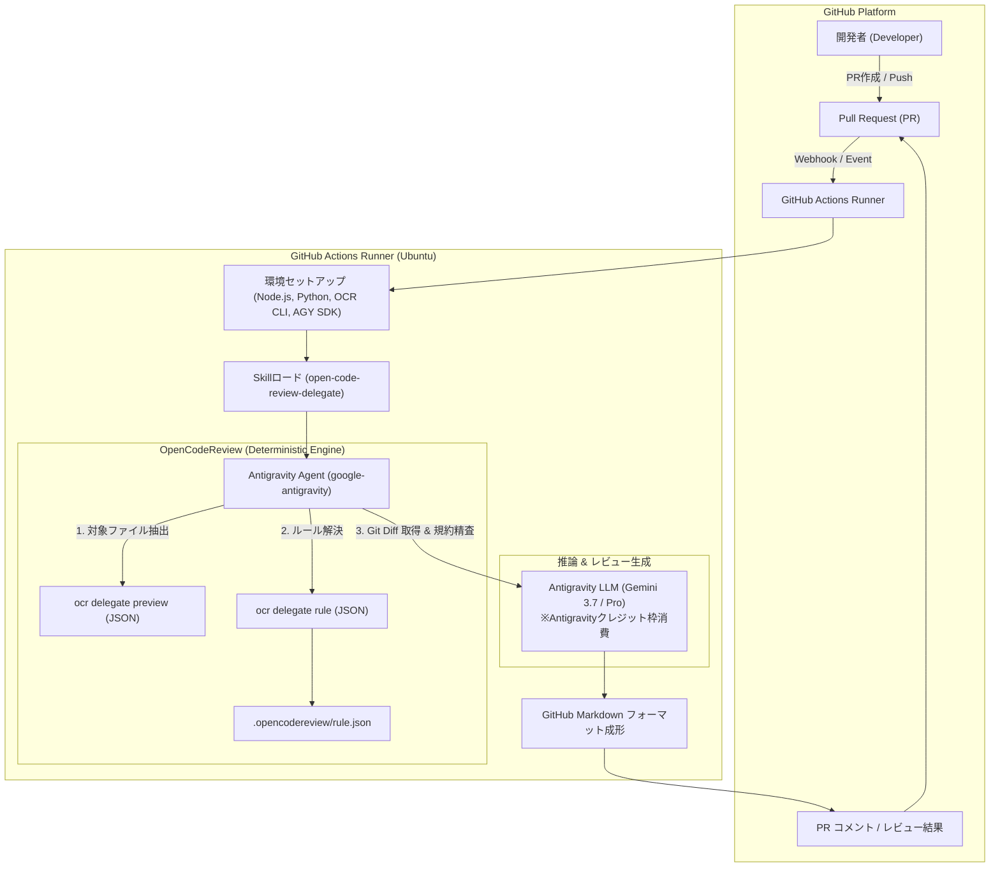
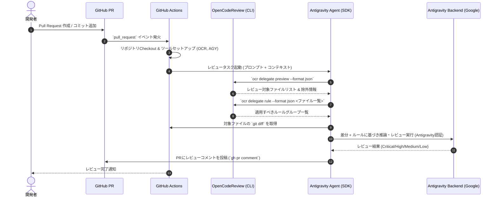

# Antigravity CLI × OpenCodeReview 統合 GitHub Actions 要件定義書

---

## 1. 概要・背景・目的

### 1.1 背景
- **AIコードレビューの需要増加**: 開発スピードの向上に伴い、PR（Pull Request）ごとの自動コードレビューが品質担保に不可欠となっている。
- **外部API課金の課題**: 外部LLM（OpenAI, Anthropic等）の従量課金APIキーを利用すると、PR数・コミット数に比例してコストが増加する。
- **Antigravity CLI のクレジット活用**: 契約済みの Antigravity アカウント / サブスクリプション枠を活用することで、追加の外部API費用を発生させずに高品質なAIコードレビュー（Gemini 3.7 / Pro等の推論能力）をCI上で実現したい。

### 1.2 目的
本システムは、**OpenCodeReview (OCR) の「委譲モード（Delegation Mode）」** と **Antigravity CLI / Python SDK** を統合し、GitHub Actions 上で完全自動・低コスト・高精度なPRコードレビューパイプラインを構築することを目的とする。

---

## 2. システムアーキテクチャ

### 2.1 全体構成図



### 2.2 処理シーケンス



---

## 3. 機能要件 (Functional Requirements)

### 3.1 イベントトリガー要件
| 項目ID | 機能名 | 説明 | 優先度 |
| :--- | :--- | :--- | :--- |
| **FR-01** | PR オープン時実行 | PR が新規作成された際に自動実行する (`opened`) | 必須 (P0) |
| **FR-02** | PR 更新時実行 | PR に新しいコミットがプッシュされた際に自動実行する (`synchronize`) | 必須 (P0) |
| **FR-03** | 手動再実行 | レビューを再実行したい場合に `workflow_dispatch` またはコメントコマンド (`/review`) から起動可能とする | 任意 (P1) |

### 3.2 差分解析・ルール抽出要件 (OpenCodeReview 連携)
| 項目ID | 機能名 | 説明 | 優先度 |
| :--- | :--- | :--- | :--- |
| **FR-04** | 決定論的ファイル抽出 | `ocr delegate preview` を利用し、バイナリ・生成コード・ロックファイル等の不要ファイルを自動除外する | 必須 (P0) |
| **FR-05** | リポジトリ固有ルール解決 | `ocr delegate rule` を利用し、`.opencodereview/rule.json` に定義されたファイルパターン別ルール（Nullチェック、SQLインジェクション対策等）を取得する | 必須 (P0) |
| **FR-06** | 差分サイズ考慮 | 変更行数が多いファイルについて、コンテキストウィンドウの上限を超えないようバッチ分割または要約処理を行う | 必須 (P0) |

### 3.3 レビュー生成・推論要件 (Antigravity CLI / SDK 連携)
| 項目ID | 機能名 | 説明 | 優先度 |
| :--- | :--- | :--- | :--- |
| **FR-07** | Antigravity 認証・実行 | Antigravity の認証情報を用いてエージェントを起動し、ホスト側LLM（Gemini 3.7 / Pro等）で推論を実行する | 必須 (P0) |
| **FR-08** | 重要度別分類 | 指摘事項を `Critical`, `High`, `Medium`, `Low` に分類し、不要な指摘（Low / False Positive）はフィルタリングする | 必須 (P0) |
| **FR-09** | 修正コード提案 | 指摘箇所に対して具体的な修正コード（Suggestion Diff）を Markdown 形式で提示する | 必須 (P0) |

### 3.4 結果通知・連携要件
| 項目ID | 機能名 | 説明 | 優先度 |
| :--- | :--- | :--- | :--- |
| **FR-10** | PR コメント投稿 | レビュー結果のサマリーおよび重要指摘を PR コメントとして自動投稿する | 必須 (P0) |
| **FR-11** | 冪等なコメント更新 | コミット更新時に連続でコメントが溢れないよう、同一PR内の既存ボットコメントを更新またはスレッド化する | 推奨 (P1) |
| **FR-12** | CI ステータス制御 | `Critical` や `High` の問題が検知された場合、CI ステータスを Failure/Warning にしてマージをブロック可能とする（設定可能） | 推奨 (P1) |

---

## 4. 非機能要件 (Non-Functional Requirements)

### 4.1 コスト・クレジット最適化
- **NFR-01 (外部API費用の排除)**: OCR側の外部LLM設定（OpenAI/Anthropic APIキー）を一切不要とし、全推論を Antigravity の契約アカウント枠（Gemini等）で完結させること。
- **NFR-02 (不要トークンの削減)**: OCR の `preview` フィルタリング機能により、lock ファイルやビルド成果物の diff を LLM に送信せずトークン消費を最小化する。

### 4.2 セキュリティ・認証管理
- **NFR-03 (認証情報の保護)**: Antigravity の認証トークン・APIキーは必ず **GitHub Repository Secrets**（`ANTIGRAVITY_AUTH_TOKEN` / `GEMINI_API_KEY`）で管理し、ログに平文出力されないこと。
- **NFR-04 (最小権限の原則)**: GitHub Actions の `GITHUB_TOKEN` は `contents: read` および `pull-requests: write` の必要最小限に制限すること。

### 4.3 性能・実行時間 (SLO)
- **NFR-05 (タイムアウト制御)**: PR レビュージョブ全体のタイムアウトを最大 15 分とし、ハングアップを防止すること。
- **NFR-06 (実行速度)**: 通常規模の PR（差分 500 行未満）において、3 分以内にレビューコメントの投稿を完了すること。

### 4.4 信頼性・可用性
- **NFR-07 (フォールバック)**: レビュー対象ファイルが存在しない場合（ドキュメント変更のみ等）、無駄な推論を行わずに「変更対象なし」として即時終了すること。

---

## 5. 成果物・設定ファイル構成仕様

### 5.1 ディレクトリ構成

```text
.github/
  workflows/
    antigravity-review.yml     # 統合 GitHub Actions ワークフロー
.agents/
  skills/
    open-code-review-delegate/ # Antigravity 向け委譲モードスキル定義
      SKILL.md
.opencodereview/
  rule.json                    # プロジェクト固有のレビュー規約定義 (任意)
```

### 5.2 ワークフロー設定例 (`.github/workflows/antigravity-review.yml`)

```yaml
name: Antigravity Code Review

on:
  pull_request:
    types: [opened, synchronize, reopened]

permissions:
  contents: read
  pull-requests: write

concurrency:
  group: ${{ github.workflow }}-${{ github.head_ref || github.run_id }}
  cancel-in-progress: true

jobs:
  ai-review:
    name: Run AI Review via Antigravity & OCR
    runs-on: ubuntu-latest
    timeout-minutes: 15

    steps:
      - name: Checkout Code
        uses: actions/checkout@v4
        with:
          fetch-depth: 0

      - name: Setup Node.js (OpenCodeReview)
        uses: actions/setup-node@v4
        with:
          node-version: '20'

      - name: Install OpenCodeReview CLI
        run: npm install -g @alibaba-group/open-code-review

      - name: Setup Python (Antigravity Agent)
        uses: actions/setup-python@v5
        with:
          python-version: '3.11'

      - name: Install Antigravity SDK
        run: pip install google-antigravity

      - name: Setup Skill Definition
        run: |
          mkdir -p .agents/skills
          cp -r skills/open-code-review-delegate .agents/skills/

      - name: Execute Antigravity Review
        env:
          ANTIGRAVITY_API_KEY: ${{ secrets.ANTIGRAVITY_AUTH_TOKEN }}
          GITHUB_TOKEN: ${{ secrets.GITHUB_TOKEN }}
          PR_NUMBER: ${{ github.event.pull_request.number }}
          BASE_BRANCH: ${{ github.base_ref }}
        run: |
          python - << 'EOF'
          import asyncio
          import os
          import subprocess
          from google.antigravity import Agent, LocalAgentConfig, CapabilitiesConfig

          async def main():
              base_branch = os.environ.get("BASE_BRANCH", "main")
              pr_number = os.environ.get("PR_NUMBER")
              
              config = LocalAgentConfig(
                  system_instructions=(
                      "あなたは経験豊富なシニアエンジニア兼コードレビュアーです。"
                      ".agents/skills/open-code-review-delegate/SKILL.md の指示に従って、"
                      "ocr delegate コマンドを活用した厳格なコードレビューを実施してください。"
                  ),
                  capabilities=CapabilitiesConfig(allow_run_command=True)
              )

              prompt = f"""
              origin/{base_branch} からの差分に対してPR #{pr_number} のコードレビューを行ってください。

              【手順】
              1. `ocr delegate preview --format json --from origin/{base_branch}` を実行して対象ファイルを確認
              2. 対象ファイルに対して `ocr delegate rule --format json <ファイル一覧>` でルールを確認
              3. 各差分を精査し、Critical/High/Medium な問題を特定
              4. 以下の構成で Markdown を作成:
                 - ## 🤖 Antigravity AI Code Review 概要 (レビュー対象ファイル数、検出件数)
                 - ### 🚨 重大・要修正 (Critical / High)
                 - ### 💡 改善提案 (Medium)
                 - 修正提案がある場合は diff 形式のコードを提示
              """

              async with Agent(config) as agent:
                  response = await agent.chat(prompt)
                  result = ""
                  async for token in response:
                      result += token

              # PRコメントの投稿
              comment_body = f"{result}\n\n---\n*Powered by Antigravity CLI & OpenCodeReview*"
              subprocess.run([
                  "gh", "pr", "comment", pr_number, "--body", comment_body
              ], check=True)

          if __name__ == "__main__":
              asyncio.run(main())
          EOF
```

---

## 6. 導入・運用手順

1. **GitHub Secrets の設定**:
   - `ANTIGRAVITY_AUTH_TOKEN`（Antigravity 認証トークンまたは Gemini API Key）をリポジトリ Secrets に登録。
2. **ワークフローファイルのコミット**:
   - `.github/workflows/antigravity-review.yml` をリポジトリに配置。
3. **ルール定義のカスタマイズ (任意)**:
   - `.opencodereview/rule.json` を配置し、プロジェクト固有のコーディング規約・セキュリティ規約を設定。
4. **動作検証**:
   - テスト用 PR を作成し、GitHub Actions の実行ログおよび PR コメントの投稿を確認。

## 7. 参考ソース

- [OpenCodeReview](https://github.com/alibaba/open-code-review)
- [AntigravityPythonSDK](https://github.com/google-antigravity/antigravity-sdk-python)
- [Antigravity CLI Overview](https://antigravity.google/docs/cli/overview)
