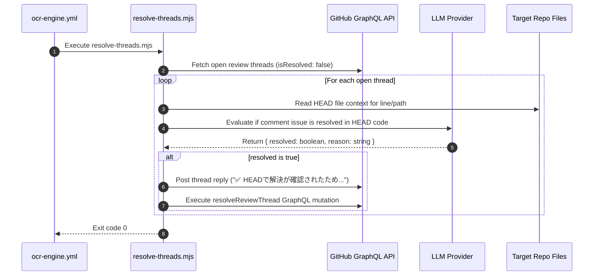

# Design Spec: Auto-Resolve Fixed Review Threads at HEAD

**Date:** 2026-08-07  
**Topic:** Automatic Resolution of Fixed Review Threads via LLM Evaluation  
**Target Repository:** `yohi/ocr-app`

---

## 1. Executive Summary

This feature automatically evaluates unresolved GitHub Pull Request review threads (from both human reviewers and automated tools) whenever a PR is updated. For each open review thread, a Node.js script fetches the thread's comment history and the current code at HEAD, queries an LLM API to evaluate whether the pointed-out issue has been resolved, and if so, posts a confirmation reply comment and resolves the review thread on GitHub via GraphQL.

---

## 2. Architecture & Components



### Components

1. **`resolve-threads.mjs`** (`.github/workflows/scripts/resolve-threads.mjs`)
   - CLI entry point executed by `ocr-engine.yml`.
   - Arguments: `--repo owner/name --pr <pr_number> --target-dir <path_to_checkout>`.
   - Uses `GITHUB_TOKEN` for GitHub GraphQL API calls and `OCR_LLM_*` for LLM evaluation.

2. **`resolve-threads.test.mjs`** (`.github/workflows/scripts/resolve-threads.test.mjs`)
   - Unit tests using Node.js native test runner (`node:test`, `node:assert`).
   - Tests CLI argument parsing, GraphQL query/mutation building, prompt construction, LLM response parsing, and mock API interactions.

3. **Workflow Integration** (`.github/workflows/ocr-engine.yml`)
   - Adds a step `Resolve fixed review threads` before `post-ocr-comments` in `ocr-engine.yml`.

---

## 3. Detailed Data Flow & Component Interfaces

### 3.1 GraphQL API Interactions

- **Query: Fetch Open Review Threads**
  ```graphql
  query($owner: String!, $name: String!, $prNumber: Int!, $cursor: String) {
    repository(owner: $owner, name: $name) {
      pullRequest(number: $prNumber) {
        reviewThreads(first: 50, after: $cursor) {
          pageInfo {
            hasNextPage
            endCursor
          }
          nodes {
            id
            isResolved
            isOutdated
            path
            line
            originalLine
            comments(first: 50) {
              nodes {
                id
                body
                author { login }
                createdAt
              }
            }
          }
        }
      }
    }
  }
  ```

- **Mutation: Post Thread Reply**
  ```graphql
  mutation($threadId: ID!, $body: String!) {
    addPullRequestReviewThreadReply(input: {pullRequestReviewThreadId: $threadId, body: $body}) {
      comment { id }
    }
  }
  ```

- **Mutation: Resolve Thread**
  ```graphql
  mutation($threadId: ID!) {
    resolveReviewThread(input: {threadId: $threadId}) {
      thread { id isResolved }
    }
  }
  ```

### 3.2 LLM Evaluation Contract

- **Input**:
  - Thread ID & file path
  - Full comment thread conversation (comments list)
  - Target code snippet at HEAD around specified line (e.g. ±20 lines or full file)
- **LLM Prompt**:
  Requests the LLM to analyze if the issue/feedback discussed in the review thread has been fixed or addressed in the current HEAD code snippet.
- **Expected Response (Strict JSON)**:
  ```json
  {
    "resolved": true,
    "reason": "The missing null check identified in the review thread has been added at line 42."
  }
  ```

---

## 4. Error Handling & Edge Cases

1. **LLM API Unreachable or Invalid JSON**:
   - Treats evaluation as `resolved: false` by default (fails safe).
   - Logs warning with response body and error message.
2. **File Deleted or Line Out of Range**:
   - If target file no longer exists or line is invalid, passes available context or marks as unable to confirm (skip resolution).
3. **API Rate Limit / Permission Failures**:
   - Catches individual thread operation failures so processing of subsequent threads continues.
   - Script returns appropriate exit code while workflow step is set to `continue-on-error: true`.

---

## 5. Verification & Testing Strategy

1. **Unit Tests**: Run `node --test .github/workflows/scripts/resolve-threads.test.mjs` verifying:
   - Config parsing.
   - Filtering of unresolved threads.
   - Prompt generation & JSON parsing.
   - GraphQL request formatting.
2. **Integration Verification**: Run local tests mocking GitHub GraphQL and LLM API endpoints.

---
