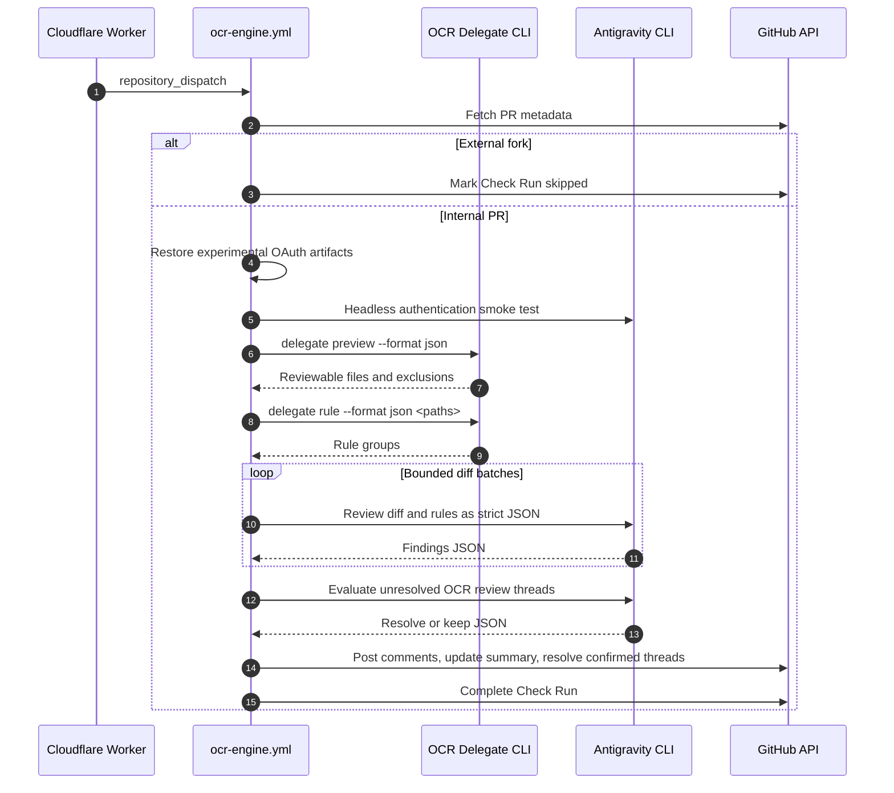

# Design Spec: Antigravity Delegation Review in the Central OCR Engine

**Date:** 2026-08-14

**Topic:** Replace the central OCR LLM path with Antigravity headless review

**Target Repository:** `yohi/ocr-app`

---

## 1. Executive Summary

This design replaces the LLM reasoning portion of the central OCR review engine with
Antigravity CLI (`agy`) while retaining the existing GitHub App, Cloudflare Worker,
`repository_dispatch`, GitHub Check Run, and PR-commenting path.

OpenCodeReview delegation mode supplies deterministic file selection and rule resolution.
Antigravity receives only the resulting diff batches and rules, then returns strictly
validated JSON findings. Existing comment-posting logic converts the validated findings
into GitHub inline comments and an updatable PR summary.

The requested Google AI Pro authentication uses locally obtained Gemini OAuth artifacts
restored from GitHub Secrets. Antigravity does not officially document importing those
artifacts for CI authentication. This is therefore an experimental, explicitly accepted
compatibility dependency. The workflow must perform a non-interactive authentication
smoke test and fail safely when the restored credentials cannot authenticate `agy`.

---

## 2. Scope and Decisions

### In scope

- Replace `ocr review` and the OpenAI-compatible LLM proxy in `ocr-engine.yml`.
- Use `ocr delegate preview` and `ocr delegate rule` as the deterministic review
  preprocessor.
- Run Antigravity in headless JSON mode for review findings and thread-resolution
  decisions.
- Preserve the current GitHub App dispatch, Check Run, inline-comment, summary-comment,
  artifact, and conservative thread-resolution responsibilities.
- Update one marked PR summary comment instead of creating a new summary on every run.
- Skip external fork PRs before restoring any secret.

### Out of scope

- A new per-target-repository review workflow.
- A new `.agents/` skill or other project-local agent configuration.
- `pull_request_target` execution for untrusted fork code.
- Guaranteed support for Google AI Pro OAuth restoration by Antigravity.
- Blocking merges based on review findings.

### Accepted operational constraints

1. The review runs only for internal PRs whose head repository equals the base repository.
2. External fork PRs produce a non-failing skipped Check Run and no LLM request.
3. Critical and High findings are visible but non-blocking.
4. Authentication, CLI, output-validation, and GitHub API failures make the Check Run fail.
5. Thread resolution is fail-safe: only an explicit `resolve` decision resolves a thread.

---

## 3. Architecture and Components



### Workflow integration

`.github/workflows/ocr-engine.yml` remains the single central execution point. It keeps
the current repository parsing, GitHub App token generation, target checkout, Check Run
updates, artifact upload, and PR-comment posting flow.

The following steps replace the LLM proxy and `ocr review` steps:

1. Fetch PR metadata using the GitHub App token and reject external forks.
2. Install a tested, pinned OCR CLI version and a tested, pinned Antigravity CLI version.
3. Restore OAuth artifacts only after the fork check, with restrictive file permissions.
4. Run the Antigravity headless authentication smoke test.
5. Run the review orchestrator and then conservative thread resolution.
6. Post validated findings and complete the Check Run.

No secret value, decoded OAuth artifact, complete diff, or complete prompt is written to
workflow logs or uploaded as an artifact. Base64 is transport encoding, not encryption.

### New and changed modules

1. **Review orchestrator**
   - New Node.js module under `.github/workflows/scripts/`.
   - Runs `ocr delegate preview --format json` and validates `schema_version`.
   - Calls `ocr delegate rule --format json` for reviewable file paths.
   - Reads diffs from Git, batches them by configurable size limits, invokes `agy`, and
     emits the existing OCR-result-compatible JSON consumed by comment posting.

2. **Antigravity command adapter**
   - New Node.js module under `.github/workflows/scripts/`.
   - Runs `agy -p` with `--output-format json`, a strict JSON schema, a timeout, and no
     file-writing or arbitrary-command permissions.
   - Treats all diff content and review-thread text as untrusted data, not instructions.
   - Rejects malformed output rather than repairing or guessing its meaning.

3. **Thread resolver**
   - Update `.github/workflows/scripts/resolve-threads.mjs` to replace its old LLM HTTP
     request with the Antigravity command adapter.
   - Preserve existing GraphQL retrieval and mutation behavior.
   - Limit candidates to unresolved review threads created by OpenCodeReview.

4. **Comment poster**
   - Update `.github/workflows/scripts/post-ocr-comments.mjs` to locate a summary comment
     by a stable HTML marker and update it in place.
   - Keep GitHub Review inline comments for newly validated findings.

5. **Prompt definitions**
   - Store versioned review and resolution prompt builders with the workflow scripts.
   - Do not create `.agents/`, `SKILL.md`, or any other new agent-configuration path.

---

## 4. Data Contracts and Processing

### OCR delegation contract

The orchestrator invokes the following commands from the checked-out target repository:

```text
ocr delegate preview --format json --from origin/<base> --to <head>
ocr delegate rule --format json <reviewable-path...>
```

`preview` determines reviewability, exclusions, merge base, and per-file change counts.
`rule` groups the selected paths by applicable rule text. The orchestrator validates the
reported schema version before relying on either output.

Files are processed in deterministic rule groups and bounded diff batches. The default
batch limit is configurable through repository variables for maximum characters and
maximum files. Each reviewable file must be recorded as reviewed or skipped with a reason.

### Antigravity review result contract

Each `agy` invocation must return JSON matching a schema equivalent to:

```json
{
  "findings": [
    {
      "severity": "Critical | High | Medium | Low",
      "path": "relative/path",
      "line": 42,
      "title": "Short finding title",
      "body": "Evidence and impact",
      "suggestion": "Optional replacement code"
    }
  ]
}
```

The adapter accepts only `Critical`, `High`, `Medium`, and `Low`. It verifies that every
path belongs to the selected batch and every line can be mapped to the current PR diff.
Invalid findings are discarded and recorded as a validation error. Low findings may be
filtered from the published result, but the filtering policy is deterministic and tested.

### Thread-resolution contract

For each eligible unresolved review thread, the resolver provides its comment history and
current file context to `agy`. The required response is:

```json
{
  "decision": "resolve | keep",
  "reason": "Evidence from the current code"
}
```

Only `resolve` triggers the existing GitHub GraphQL reply and `resolveReviewThread`
mutation. Any parse error, timeout, missing file, ambiguous context, or non-`resolve`
response leaves the thread unresolved.

### Check Run and comment behavior

| Condition | Check Run result | PR behavior |
| --- | --- | --- |
| External fork | `neutral` | One skipped summary; no credential restoration |
| No reviewable file | `success` | One skipped summary; no LLM request |
| Valid review, any severity | `success` or `neutral` | Inline findings and updated summary |
| Authentication or CLI failure | `failure` | Failure summary without secret details |
| Invalid LLM output or GitHub API failure | `failure` | Failure summary and sanitized diagnostic artifact |

The summary comment contains a stable marker such as
`<!-- antigravity-ocr-summary -->`. Re-runs update that comment rather than appending a
new summary. Inline review comments remain GitHub review records; stale ones are handled
only by the conservative resolver.

---

## 5. Security and Reliability

### OAuth handling

The workflow reads these central-repository Secrets only after confirming the PR is
internal:

- `GEMINI_OAUTH_CREDS_B64`
- `GEMINI_GOOGLE_ACCOUNTS_B64`

The workflow restores the artifacts under `~/.gemini/` with owner-only permissions. The
restoration mechanism is explicitly experimental because Antigravity officially documents
native-keyring authentication, not CI import of Gemini CLI OAuth files. A headless smoke
test is the compatibility gate for every run.

The central repository must protect workflow changes through branch protection and
CODEOWNERS. Access to the two OAuth Secrets must be limited to trusted maintainers. No
workflow using these secrets may execute code from an external fork.

### Failure handling

- Missing or invalid OAuth artifact: fail before diff processing with a sanitized message.
- Failed `agy` authentication or timeout: fail the Check Run; retain no full prompt output.
- Unsupported OCR delegate schema: fail the Check Run to avoid a silent behavior change.
- No eligible files: skip successfully without calling Antigravity.
- A failed batch: fail the review run rather than posting a partial result as complete.
- A failed thread-resolution decision: retain the thread and continue processing others.
- Comment-posting failure: fail the Check Run and keep sanitized diagnostics.

Workflow timeout remains 15 minutes. Normal internal PRs under 500 changed lines must
complete review and posting within three minutes.

---

## 6. Verification Strategy

### Unit tests

Use Node.js native tests with fixtures and mocked process/GitHub boundaries to cover:

- OCR preview and rule schema validation.
- File selection, deterministic batching, and reviewed-or-skipped accounting.
- Antigravity command construction, timeout handling, and strict JSON parsing.
- Finding path and diff-line validation.
- Low-severity filtering and OCR-result-compatible output conversion.
- Fork detection and prevention of credential-restoration execution.
- Stable summary-comment upsert behavior.
- Conservative resolve/keep decisions and GraphQL mutation selection.

### Workflow and integration checks

1. Validate the GitHub Actions workflow syntax and run all existing workflow-script tests.
2. Use an internal verification PR to exercise valid review output and summary updates.
3. Exercise zero-target, authentication-failure, malformed-output, and High-finding cases.
4. Confirm that a fixed OCR-authored thread is resolved only with an explicit `resolve`
   result, while ambiguous threads remain open.
5. Inspect workflow logs and artifacts to verify that OAuth data, full prompts, and full
   diffs are absent.

### Acceptance criteria

- Internal PRs use OCR delegation and Antigravity without the prior OCR LLM proxy.
- External forks are skipped before OAuth restoration and without an LLM request.
- A PR with fewer than 500 changed lines completes in three minutes or less.
- Critical and High findings do not block merge by themselves.
- Operational failures are visible as failed Check Runs.
- A PR has at most one bot-owned summary comment after repeated runs.
- Thread resolution never resolves a thread without an explicit, valid `resolve` decision.
- All workflow-script tests pass without real OAuth or LLM credentials.

---

## 7. Rollout

1. Add the implementation behind the existing central workflow and keep the change on a
   protected branch.
2. Configure the experimental OAuth Secrets only in the central repository.
3. Verify the authentication smoke test with an internal test PR before enabling normal
   review traffic.
4. Monitor the first internal PR runs for authentication expiry, output-schema failures,
   duration, and comment-update behavior.
5. Rotate or re-register OAuth artifacts when the smoke test reports authentication expiry.

The feature remains experimental until Antigravity officially documents a CI-safe,
non-interactive authentication path for Google AI Pro subscription usage.
