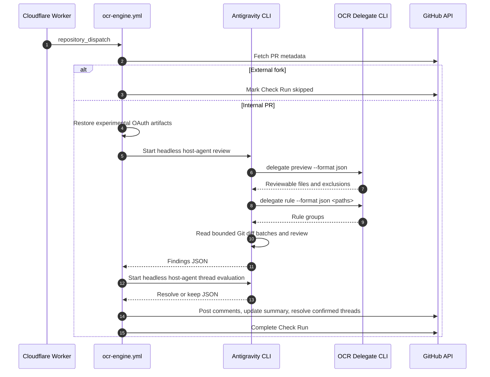

# Design Spec: Antigravity Delegation Review in the Central OCR Engine

**Date:** 2026-08-14

**Topic:** Replace the central OCR LLM path with Antigravity headless review

**Target Repository:** `yohi/ocr-app`

---

## 1. Executive Summary

This design replaces the LLM reasoning portion of the central OCR review engine with
Antigravity CLI (`agy`) while retaining the existing GitHub App, Cloudflare Worker,
`repository_dispatch`, GitHub Check Run, and PR-commenting path.

Antigravity CLI is the OpenCodeReview Delegation Mode host agent. It invokes OCR's
deterministic delegation commands, reads the necessary Git context, applies its own
Google AI Pro-backed reasoning, and returns strictly validated JSON findings. Existing
Node.js logic only launches the host agent, validates its output, and performs GitHub API
operations such as posting comments and resolving threads.

The requested Google AI Pro authentication uses locally obtained Gemini OAuth artifacts
restored from GitHub Secrets. Antigravity does not officially document importing those
artifacts for CI authentication. This is therefore an experimental, explicitly accepted
compatibility dependency. The workflow must perform a non-interactive authentication
smoke test and fail safely when the restored credentials cannot authenticate `agy`.

---

## 2. Scope and Decisions

### In scope

- Replace `ocr review` and the OpenAI-compatible LLM proxy in `ocr-engine.yml`.
- Install the official OpenCodeReview delegate skill in the CI user's Antigravity skill
  directory and run Antigravity as the Delegation Mode host agent.
- Let `agy` invoke `ocr delegate preview`, `ocr delegate rule`, and required read-only
  Git commands before generating review and thread-resolution decisions.
- Preserve the current GitHub App dispatch, Check Run, inline-comment, summary-comment,
  artifact, and conservative thread-resolution responsibilities.
- Update one marked PR summary comment instead of creating a new summary on every run.
- Skip external fork PRs before restoring any secret.

### Out of scope

- A new per-target-repository review workflow.
- A new `.agents/` skill or other project-local agent configuration.
- `pull_request_target` execution for untrusted fork code.
- Guaranteed support for Google AI Pro OAuth restoration by Antigravity.
- Blocking merges based on review findings.

### Accepted operational constraints

1. The review runs only for internal PRs whose head repository equals the base repository.
2. External fork PRs produce a non-failing skipped Check Run and no LLM request.
3. Critical and High findings are visible but non-blocking.
4. Authentication, CLI, output-validation, and GitHub API failures make the Check Run fail.
5. Thread resolution is fail-safe: only an explicit `resolve` decision resolves a thread.

---

## 3. Architecture and Components



### Workflow integration

`.github/workflows/ocr-engine.yml` remains the single central execution point. It keeps
the current repository parsing, GitHub App token generation, target checkout, Check Run
updates, artifact upload, and PR-comment posting flow.

The following steps replace the LLM proxy and `ocr review` steps:

1. Fetch PR metadata using the GitHub App token and reject external forks.
2. Install a tested, pinned OCR CLI version and a tested, pinned Antigravity CLI version.
3. Restore OAuth artifacts only after the fork check, with restrictive file permissions.
4. Install the official `open-code-review-delegate` skill in the CI user's
   `~/.gemini/antigravity-cli/skills/` directory.
5. Configure `agy` headless permissions for only the required OCR and read-only Git work.
6. Run the Antigravity host agent for review and then conservative thread resolution.
7. Post validated findings and complete the Check Run.

No secret value, decoded OAuth artifact, complete diff, or complete prompt is written to
workflow logs or uploaded as an artifact. Base64 is transport encoding, not encryption.

### New and changed modules

1. **Antigravity host runner**
   - New Node.js module under `.github/workflows/scripts/`.
   - Invokes `agy -p` with the host-review task, strict JSON output, and a timeout.
   - Does not execute `ocr delegate` or Git diff commands itself.
   - Validates the returned schema and emits the existing OCR-result-compatible JSON
     consumed by comment posting.

2. **Delegation Mode skill and permissions**
   - Install the official `open-code-review-delegate` skill at runtime in the CI user's
     `~/.gemini/antigravity-cli/skills/` directory; do not commit a project `.agents/`
     directory.
   - Allow the host agent to execute `ocr delegate preview`, `ocr delegate rule`, and
     the required read-only Git commands (`diff`, `show`, `status`, and `rev-parse`).
   - Deny file writes, `git push`, `rm`, `sudo`, network-fetch commands, unsandboxed
     commands, and `--dangerously-skip-permissions`.
   - Treat all diff content and review-thread text as untrusted data, not instructions.

3. **Thread resolver**
   - Update `.github/workflows/scripts/resolve-threads.mjs` to prepare eligible thread
     context and invoke the Antigravity host runner instead of its old LLM HTTP request.
   - Preserve existing GraphQL retrieval and mutation behavior.
   - Limit candidates to unresolved review threads created by OpenCodeReview.

4. **Comment poster**
   - Update `.github/workflows/scripts/post-ocr-comments.mjs` to locate a summary comment
     by a stable HTML marker and update it in place.
   - Keep GitHub Review inline comments for newly validated findings.

5. **Host tasks**
   - The review task tells `agy` to follow the installed OpenCodeReview delegate skill,
     process every reviewable file, and return the required JSON result.
   - The thread task provides prepared thread context and requests a conservative JSON
     `resolve` or `keep` decision.

---

## 4. Data Contracts and Processing

### OCR delegation contract

The Antigravity host agent invokes the following commands from the checked-out target
repository:

```text
ocr delegate preview --format json --from origin/<base> --to <commit_sha>
ocr delegate rule --format json <reviewable-path...>
```

`preview` determines reviewability, exclusions, merge base, and per-file change counts using
the immutable `commit_sha` provided in the dispatch payload (never a mutable branch ref).
`rule` groups the selected paths by applicable rule text. The host agent must validate the
reported schema version before relying on either output.

The host agent processes files in deterministic rule groups and bounded diff batches. The
defaults are 20,000 diff characters and 10 files per batch. Repository variables
`ANTIGRAVITY_MAX_DIFF_CHARS` and `ANTIGRAVITY_MAX_FILES_PER_BATCH` are clamped to fixed hard
bounds:
- `ANTIGRAVITY_MAX_DIFF_CHARS`: min 1,000, default 20,000, hard maximum 40,000. Values <= 0,
  non-numeric, or above 40,000 fallback to default or clamp to maximum.
- `ANTIGRAVITY_MAX_FILES_PER_BATCH`: min 1, default 10, hard maximum 20. Values <= 0,
  non-numeric, or above 20 fallback to default or clamp to maximum.

The final agent result must record each reviewable file as reviewed or skipped with a reason.

Before posting review findings or summary updates, the host runner revalidates that the PR's
current head SHA still matches `commit_sha`. If the head SHA has changed (e.g. due to a newer
push during execution), the runner aborts publishing to avoid posting stale results.

### Antigravity review result contract

Each `agy` review invocation runs with mode `review` and must return JSON matching
schema version `1.0` validated by the host runner:

```json
{
  "schema_version": "1.0",
  "mode": "review",
  "coverage": [
    {
      "path": "relative/path",
      "status": "reviewed | skipped",
      "reason": "Required when skipped"
    }
  ],
  "findings": [
    {
      "severity": "Critical | High | Medium | Low",
      "path": "relative/path",
      "line": 42,
      "title": "Short finding title",
      "body": "Evidence and impact",
      "suggestion": "Optional replacement code"
    }
  ]
}
```

The host runner validator accepts only `Critical`, `High`, `Medium`, and `Low`. It verifies
that each reported line can be mapped to the current PR diff and rejects malformed output.
Low findings may be filtered from the published result, but the filtering policy is
deterministic and tested.

### Thread-resolution contract

For each eligible unresolved review thread, the thread resolver invokes `agy` in `thread`
mode. The required response matching schema version `1.0` is:

```json
{
  "schema_version": "1.0",
  "mode": "thread",
  "decision": "resolve | keep",
  "reason": "Evidence from the current code"
}
```

Only an explicit `resolve` triggers the existing GitHub GraphQL reply and `resolveReviewThread`
mutation. Any parse error, timeout, missing file, ambiguous context, or non-`resolve`
response leaves the thread unresolved.

### Check Run and comment behavior

| Condition | Check Run result | PR behavior |
| --- | --- | --- |
| External fork | `neutral` | One skipped summary; no credential restoration |
| No reviewable file | `success` | One skipped summary; no LLM request |
| Valid review, any severity | `success` or `neutral` | Inline findings and updated summary |
| Authentication or CLI failure | `failure` | Failure summary without secret details |
| Invalid LLM output or GitHub API failure | `failure` | Failure summary and sanitized diagnostic artifact |

The summary comment contains an exact matching marker `<!-- antigravity-ocr-summary -->`.
Re-runs inspect existing comments to confirm both the exact marker and the expected bot login
owner before performing a PATCH, and only POST if absent. This prevents modifying user comments
or duplicating bot comments. Inline review comments remain GitHub review records; stale ones
are handled only by the conservative resolver.

---

## 5. Security and Reliability

### OAuth handling and Trusted Checkout Boundary

The workflow reads central-repository Secrets only after confirming the PR is internal:

- `GEMINI_OAUTH_CREDS_B64`
- `GEMINI_GOOGLE_ACCOUNTS_B64`

**Trusted Checkout Execution Boundary:**
- The runner checks out only the protected `base` revision (or workflow repository code) as
  the trusted execution environment. All workflows, Node.js scripts, configuration, and
  installed delegate skills are strictly executed from this trusted source.
- PR `head` code and files are fetched purely as passive diff data (`git diff`, `git show`,
  `ocr delegate preview/rule`). No scripts, build hooks, configuration files, skills, or
  prompts originating from the PR `head` are ever executed or loaded into the host environment.

The workflow restores the OAuth artifacts under `~/.gemini/` with owner-only permissions (`600`).
It installs the official delegate skill separately under `~/.gemini/antigravity-cli/skills/` for the
ephemeral CI user. The restoration mechanism is explicitly experimental because Antigravity
officially documents native-keyring authentication, not CI import of Gemini CLI OAuth files. A
headless smoke test is the compatibility gate for every run.

The central repository must protect workflow changes through branch protection and CODEOWNERS.
Access to the two OAuth Secrets must be limited to trusted maintainers. No workflow using these
secrets may execute code from an external fork.

### Failure handling

- Missing or invalid OAuth artifact: fail before diff processing with a sanitized message.
- Failed `agy` authentication or timeout: fail the Check Run; retain no full prompt output.
- Unsupported OCR delegate schema reported by the host agent: fail the Check Run to avoid
  a silent behavior change.
- No eligible files: skip successfully without calling Antigravity.
- A failed batch: fail the review run rather than posting a partial result as complete.
- A failed thread-resolution decision: retain the thread and continue processing others.
- Comment-posting failure: fail the Check Run and keep sanitized diagnostics.

Workflow timeout remains 15 minutes. Normal internal PRs under 500 changed lines must
complete review and posting within three minutes.

---

## 6. Verification Strategy

### Unit tests

Use Node.js native tests with fixtures and mocked process/GitHub boundaries to cover:

- OCR preview and rule schema validation.
- File selection, deterministic batching, and reviewed-or-skipped accounting.
- Antigravity host-task construction, permission-policy generation, timeout handling, and
  strict JSON parsing.
- Finding path and diff-line validation.
- Low-severity filtering and OCR-result-compatible output conversion.
- Fork detection and prevention of credential-restoration execution.
- Stable summary-comment upsert behavior.
- Conservative resolve/keep decisions and GraphQL mutation selection.

### Workflow and integration checks

1. Validate the GitHub Actions workflow syntax and run all existing workflow-script tests.
2. Use an internal verification PR to exercise valid review output and summary updates.
3. Exercise zero-target, authentication-failure, malformed-output, and High-finding cases.
4. Confirm that a fixed OCR-authored thread is resolved only with an explicit `resolve`
   result, while ambiguous threads remain open.
5. Inspect workflow logs and artifacts to verify that OAuth data, full prompts, and full
   diffs are absent.

### Acceptance criteria

- Internal PRs use Antigravity as the OCR Delegation Mode host without the prior OCR LLM
  proxy.
- External forks are skipped before OAuth restoration and without an LLM request.
- A PR with fewer than 500 changed lines completes in three minutes or less.
- Critical and High findings do not block merge by themselves.
- Operational failures are visible as failed Check Runs.
- A PR has at most one bot-owned summary comment after repeated runs.
- Thread resolution never resolves a thread without an explicit, valid `resolve` decision.
- All workflow-script tests pass without real OAuth or LLM credentials.

---

## 7. Rollout

1. Add the implementation behind the existing central workflow and keep the change on a
   protected branch.
2. Configure the experimental OAuth Secrets only in the central repository.
3. Verify the authentication smoke test with an internal test PR before enabling normal
   review traffic.
4. Monitor the first internal PR runs for authentication expiry, output-schema failures,
   duration, and comment-update behavior.
5. Rotate or re-register OAuth artifacts when the smoke test reports authentication expiry.

The feature remains experimental until Antigravity officially documents a CI-safe,
non-interactive authentication path for Google AI Pro subscription usage.
